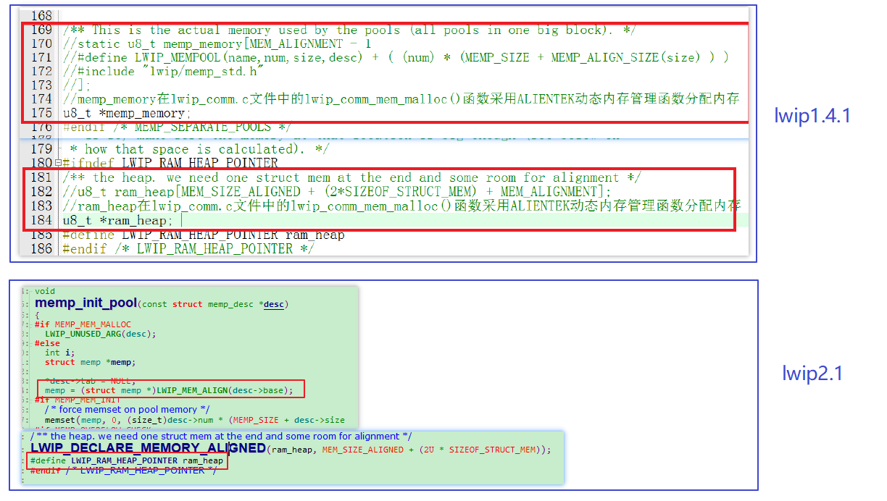
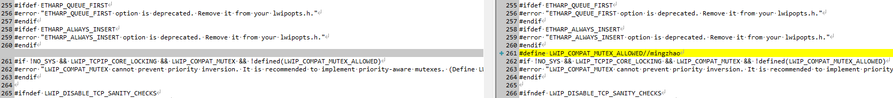

# stm32-lwip

### 说明

* 没有按照 正点原子 教程中修改icmp.c文件中**硬件帧校验**的代码
* 没有使用片外flash。（因此，不需要修改mem.c中的ram_heap；memp.c中的memp_memory）
    * lwip2.1与1.4的内存池与内存堆的不同：
    * lwip2.1中没有memp_memory数组，改为memp = (struct memp *)LWIP_MEM_ALIGN(desc->base);
    * lwip2.1中内存堆与内存池的定义方式也不太相同
    * 

## 带操作系统移植说明

### ucosii

* 结合正点原子教程移植
* 由于正点原子使用的是1.4.1，所以这里会有些错误需要解决（主要为lwip1.4.1升级到2.1的一些问题）
* lwip1.4.1升级为2.1说明
    * http://www.armbbs.cn/forum.php?mod=viewthread&tid=93665
    * https://www.jianshu.com/p/7c8b4ecfebc7
    * https://www.jianshu.com/p/deabeb6a6bf4
    * 2.1版本增加了sys_mbox_trypost_fromisr函数，这里此函数的实现与sys_mbox_trypost一致。
    * init.c中还需要添加  #define LWIP_COMPAT_MUTEX_ALLOWED
    * 
* 详细说明
    * 开启了 LWIP_COMPAT_MUTEX 宏定义 （开启宏定义：使用信号量来替代互斥量，否则还需要定义sys_mutex_t）

